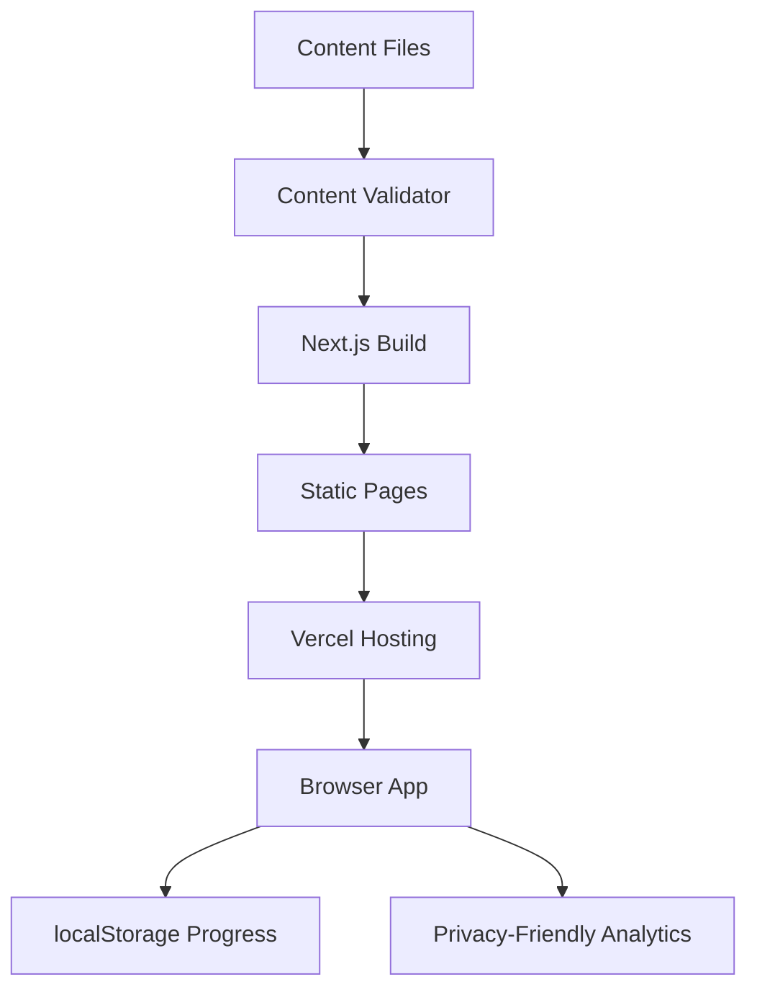
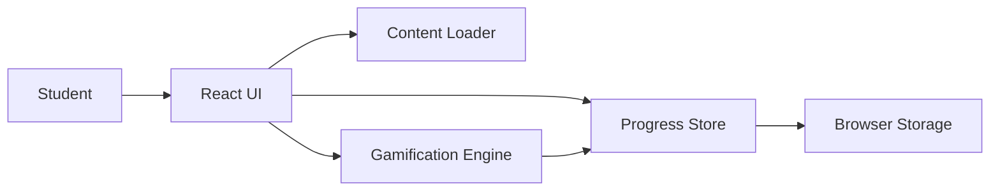
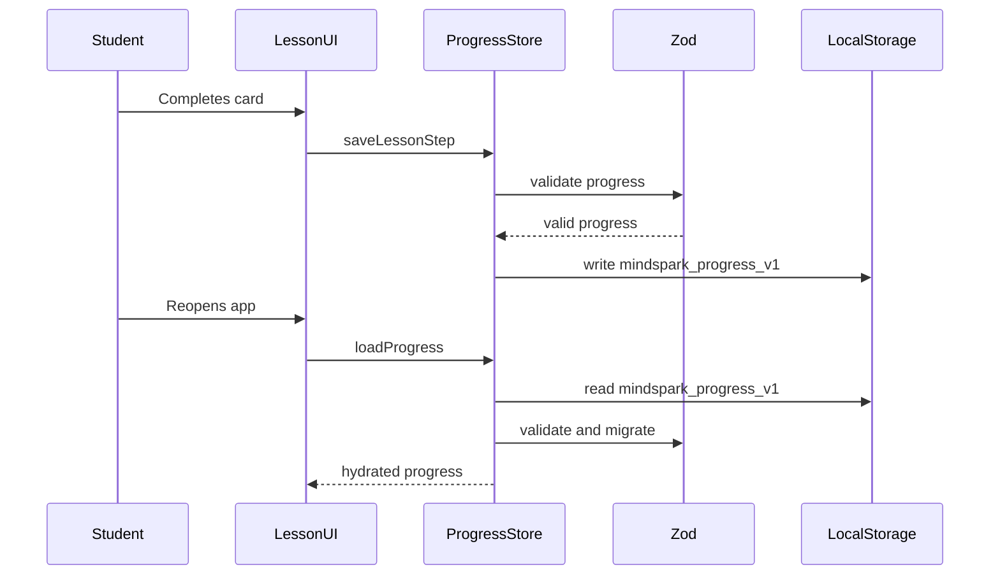
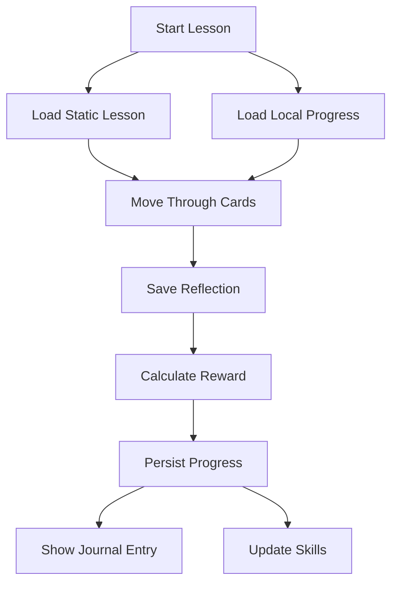
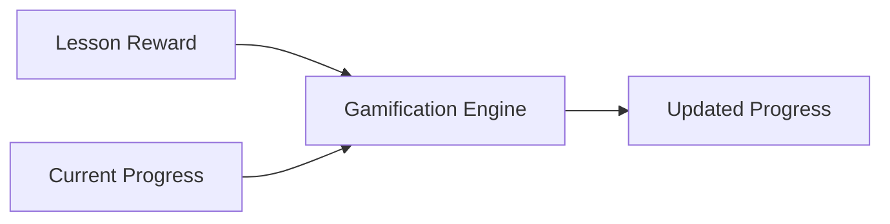
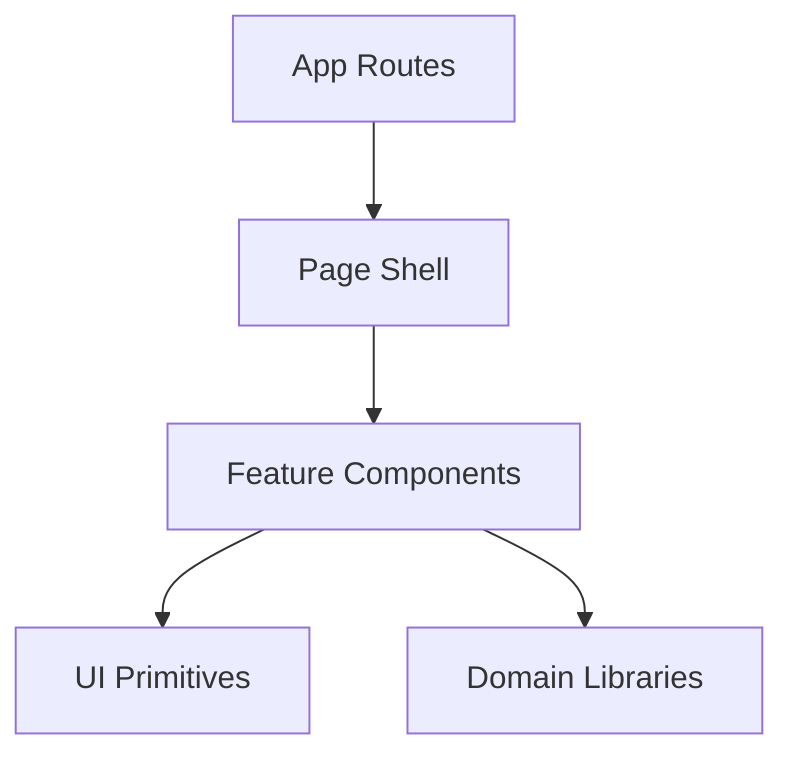
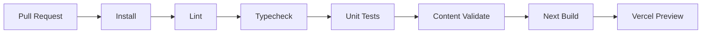

# Architecture

## 1. Overview

MindSpark should be built as a static-first responsive web app. The MVP does not need authentication, a database, or server-side user state. Product content lives in the repository, is validated at build time, and is served through statically generated pages. User progress, journal entries, streaks, badges, and saved quotes live in browser localStorage.

This keeps the first version simple, fast, cheap to deploy, and easy to iterate on Vercel.

## 2. High-Level System



Key idea: content is static and reviewed in Git; personal progress is local and private.

## 3. Runtime Architecture



Responsibilities:

| Layer | Responsibility |
| --- | --- |
| React UI | Screens, cards, navigation, input handling |
| Content Loader | Read validated static content |
| Progress Store | Load, validate, update, and persist local progress |
| Gamification Engine | Calculate XP, streaks, badges, and skill changes |
| Browser Storage | Persist local-only user data |

## 4. Suggested Repository Layout

```text
mahapurush/
├── content/
│   ├── thinkers/
│   ├── paths/
│   ├── daily-sparks/
│   ├── quote-cards/
│   └── weekly-challenges/
├── docs/
├── public/
│   └── assets/
├── src/
│   ├── app/
│   ├── components/
│   ├── hooks/
│   ├── lib/
│   │   ├── analytics/
│   │   ├── content/
│   │   ├── gamification/
│   │   └── progress/
│   └── types/
└── tests/
```

## 5. Route Architecture

| Route | Data source | User state | Notes |
| --- | --- | --- | --- |
| `/` | Daily spark content | Reads progress | Home dashboard |
| `/onboarding` | Path and quiz config | Writes onboarding result | No auth |
| `/explore` | Thinker meta | Reads progress | Category and alphabet browsing |
| `/thinkers/[slug]` | Thinker meta and lessons | Reads journey progress | Static route |
| `/thinkers/[slug]/lessons/[lessonId]` | Lesson content | Reads/writes lesson progress | Interactive client flow |
| `/paths` | Path content | Reads progress | Static route |
| `/paths/[slug]` | Path content and thinker meta | Reads progress | Static route |
| `/journal` | None | Reads/writes journal | Client-only personal page |
| `/you` | None | Reads progress | Skills, badges, streaks |
| `/quotes/[id]` | Quote card content | Reads saved state | Shareable route |

## 6. Content Architecture

Content should be structured so it can be validated and statically generated.

### Thinker Folder

```text
content/thinkers/socrates/
├── meta.json
└── lessons/
    ├── 01-questions-are-dangerous.json
    ├── 02-opinion-vs-truth.json
    ├── 03-asking-better-questions.json
    ├── 04-social-media-through-socrates.json
    └── 05-defend-an-unpopular-opinion.json
```

### Example Thinker Meta

```json
{
  "id": "socrates",
  "slug": "socrates",
  "name": "Socrates",
  "shortName": "Socrates",
  "era": "470-399 BCE",
  "region": "Athens",
  "portrait": "/assets/thinkers/socrates.webp",
  "hook": "Socrates was killed for asking too many questions.",
  "categories": ["logic-reason", "identity-self"],
  "skills": ["questioning", "logic", "courage"],
  "summary": "Socrates taught people to test beliefs instead of borrowing opinions."
}
```

### Example Lesson Shape

```json
{
  "id": "socrates-01",
  "thinkerId": "socrates",
  "order": 1,
  "title": "Why Questions Are Dangerous",
  "estimatedMinutes": 4,
  "layers": {
    "quick": {
      "hook": "Socrates was killed for asking too many questions.",
      "story": "In Athens, Socrates became famous because he asked people to explain their beliefs...",
      "bigIdea": {
        "title": "Test borrowed opinions",
        "explanation": "Do not accept an idea only because it is popular or powerful."
      },
      "thinkingTool": {
        "name": "Ask why three times",
        "instruction": "Before accepting a belief, ask why it is true, why people believe it, and why it matters."
      },
      "modernTest": {
        "scenario": "Your class is mocking someone online and calling it a joke.",
        "question": "What would Socrates ask first?",
        "options": [
          {
            "id": "a",
            "label": "Is everyone doing it proof that it is right?",
            "explanation": "This tests the assumption that popularity equals truth."
          },
          {
            "id": "b",
            "label": "How many likes did it get?",
            "explanation": "This measures popularity, not moral strength."
          }
        ],
        "discussionNotes": "The point is to separate social proof from moral reasoning."
      },
      "reflectionPrompt": "Write one belief you have that you may have never questioned properly.",
      "thoughtTension": {
        "counterView": "But if you question everything, can you ever feel certain?",
        "responsePrompt": "When is questioning useful, and when can it become avoidance?"
      },
      "rewards": {
        "xp": 20,
        "badge": "questioner",
        "skills": [
          {
            "id": "questioning",
            "points": 2
          }
        ]
      }
    },
    "full": {}
  }
}
```

Note: the `full` layer must use the same schema as `quick`; it is omitted above only to keep the example readable.

## 7. Progress Architecture

Progress is local-only in the MVP.



### Storage Key

```text
mindspark_progress_v1
```

### Progress Object

```json
{
  "version": 1,
  "onboardingComplete": true,
  "selectedPathId": "questioners-path",
  "xp": 120,
  "streak": {
    "current": 3,
    "longest": 5,
    "lastActiveDate": "2026-06-01"
  },
  "completedLessons": ["socrates-01"],
  "lessonSteps": {
    "socrates-02": 3
  },
  "skillLevels": {
    "questioning": 4,
    "logic": 2,
    "justice": 1
  },
  "badges": ["questioner"],
  "journalEntries": [],
  "savedQuotes": ["socrates-unexamined-life"]
}
```

## 8. Data Flow: Completing a Lesson



Implementation notes:

- Save current step after every card.
- Save reflection immediately when submitted.
- Award lesson completion once only.
- Do not double-count XP if the user replays a completed lesson.
- Allow users to revisit lessons without changing old journal entries unless they explicitly write a new response.

## 9. Gamification Architecture

The gamification engine should be a pure TypeScript module. It receives existing progress and lesson rewards, then returns updated progress.



Pure functions to implement:

- `calculateLessonXp`.
- `updateSkillLevels`.
- `updateStreak`.
- `checkEarnedBadges`.
- `completeLesson`.

The UI should not decide XP, badges, or streak logic directly.

## 10. Component Architecture



Feature component groups:

- `components/lesson`: lesson card flow.
- `components/journal`: journal list, filters, export.
- `components/progress`: skill map, badges, streak.
- `components/explore`: library, categories, thinker cards.
- `components/ui`: reusable primitives.

Domain libraries:

- `lib/content`: loaders, schemas, validation.
- `lib/progress`: local persistence, migrations.
- `lib/gamification`: XP, skills, streaks, badges.
- `lib/analytics`: event wrapper.

## 11. Static Generation Strategy

Use static generation for:

- Thinker profiles.
- Path pages.
- Quote card pages.
- Public content pages.

Use client rendering for:

- Journal.
- User progress dashboard.
- Lesson interaction state.
- Onboarding answers.

This approach keeps public content fast and searchable while keeping personal state private.

## 12. Privacy Boundaries

The MVP privacy boundary is simple:

| Data | Location | Sent to server? |
| --- | --- | --- |
| Thinker content | Repository/static build | Yes, public content only |
| Lessons | Repository/static build | Yes, public content only |
| Daily sparks | Repository/static build | Yes, public content only |
| Journal entries | Browser localStorage | No |
| XP and badges | Browser localStorage | No |
| Streaks | Browser localStorage | No |
| Analytics events | Analytics provider | Yes, event names only |

Never send reflection text, journal entries, or free-form student writing to analytics.

## 13. Build and Validation Pipeline



Content validation should run before `next build` so broken content fails early.

## 14. Future Extension Points

### Optional Auth and Sync

Introduce a `ProgressStore` interface:

```ts
export interface ProgressStore {
  load(): Promise<Progress>;
  save(progress: Progress): Promise<void>;
  export(): Promise<string>;
  import(raw: string): Promise<Progress>;
}
```

MVP implementation:

```text
LocalStorageProgressStore
```

Future implementation:

```text
ApiProgressStore
```

### AI Coach

Do not build in MVP. When added later, keep it behind a server route:

```text
/api/coach
```

Rules for future AI:

- Never expose AI provider keys to the client.
- Rate limit requests.
- Do not train on student journal content without explicit consent.
- Keep modes constrained: Socrates, Einstein, Ambedkar, Buddha, Curie, Tagore.

### Internationalization

Design for future localization:

- Keep content IDs stable across languages.
- Use locale folders later, such as `content/en` and `content/bn`.
- Avoid hardcoding UI strings deep in components.
- Do not build translation infrastructure in MVP unless needed.

## 15. Architectural Decisions

| Decision | Reason |
| --- | --- |
| Static content in repo | Easier editorial review and no CMS dependency |
| localStorage progress | Matches no-auth MVP requirement |
| Zod validation | Protects app from malformed content |
| Pure gamification module | Easier tests and fewer UI bugs |
| Vercel deployment | Fast preview deploys and strong Next.js support |
| No database | Avoids unnecessary complexity before product validation |
| No public social features | Protects teen users from pressure and toxicity |

## 16. MVP Technical Definition of Done

The architecture is implemented correctly when:

- Content can be validated from a script.
- Static routes build from content files.
- Lesson progress persists locally after refresh.
- Journal entries are local-only and exportable.
- Completing a lesson updates XP, streak, badges, and skills once.
- The app deploys to Vercel without server secrets.
- The codebase can later add auth by replacing the progress store, not rewriting all UI.
