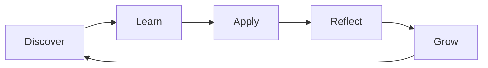
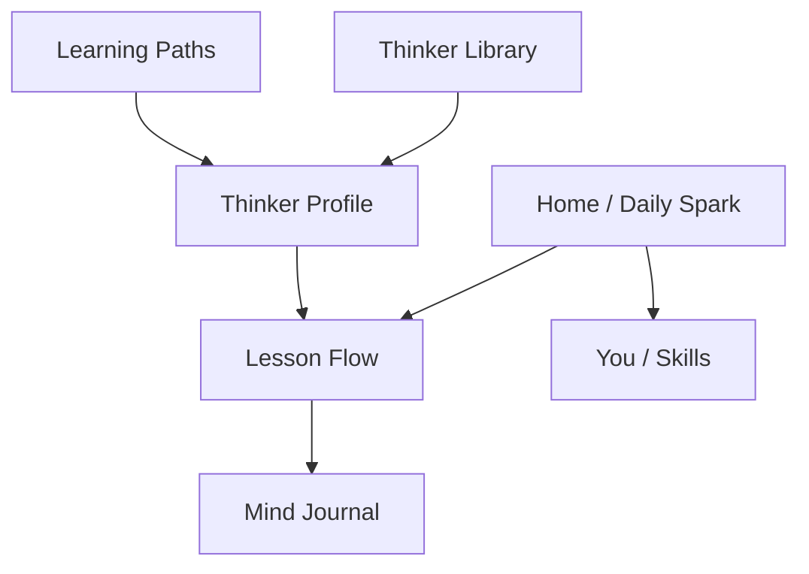

# MindSpark: Think Like the Greats PRD

## Document Control

| Field | Value |
| --- | --- |
| Product name | MindSpark: Think Like the Greats |
| Subtitle | Inspired by Mahapurusher Mohakotha |
| Version | 1.0 MVP |
| Owner | Debangsha |
| Target users | Curious people across life stages |
| Platform | Responsive web, mobile-first |
| Language | English for MVP |
| Authentication | None for MVP |
| Hosting | Vercel |

## 1. Product Summary

MindSpark helps modern learners discover the world's great thinkers through short, interactive learning experiences. The product should feel like a thinking gym: users learn a powerful idea, apply it to a modern dilemma, reflect privately, and grow a visible set of mental skills.

The product is not a quote collection or a biography app. Its central promise is:

> Learn how great minds questioned the world, then learn to question it yourself.

Success means a user can look at a problem from their own life and ask, "How would this thinker approach this?" The app should inform, educate, and provoke independent thought without becoming preachy or academic.

## 2. Problem Statement

People often meet great thinkers through textbooks, dates, exams, and isolated quotes. That format rarely helps them understand why the ideas mattered or how those ideas can be used in real life.

Modern learners across ages are ready for serious questions about identity, justice, ambition, technology, relationships, success, courage, and meaning. They need content that is short, emotionally relevant, visually clear, and intellectually honest.

MindSpark fills the gap between dry school material and shallow inspirational content by turning great ideas into applied thinking exercises.

## 3. Product Vision

MindSpark should become a daily practice app for independent thought. It should help users:

- Understand great thinkers as real humans who faced real problems.
- Learn one clear idea at a time.
- Apply ideas to modern situations across work, family, technology, and civic life.
- See disagreement between thinkers as a strength, not confusion.
- Build mental skills such as questioning, logic, courage, empathy, imagination, justice, and self-awareness.
- Keep a private record of how their thinking changes over time.

## 4. Target Users

### Primary Audience

Curious people across life stages.

They may be students, working adults, parents, caregivers, career changers, or lifelong learners. The tone should respect their intelligence without sounding like a lecture.

### User Needs

| User type | Need | Product response |
| --- | --- | --- |
| Curious learner | Wants ideas that feel alive | Hooks, dilemmas, modern examples |
| Time-strapped adult | Has limited time | 60-second Quick Spark option |
| Creative thinker | Wants imagination and self-expression | Creative Mind path, quote cards, journal prompts |
| Socially conscious learner | Cares about fairness and society | Justice path, Ambedkar, MLK, Mandela, Beauvoir |
| Private reflector | Wants private thinking space | Mind Journal, no public ranking |

### What Users Usually Dislike

- Long biographies.
- Moral lectures.
- Dry history.
- Abstract philosophy without practical relevance.
- Memorizing names, dates, and quotes.
- Being told what to think.

### What Users Respond To

- Stories.
- Dilemmas.
- Debate.
- Identity.
- Intellectual independence.
- Progress and unlocks.
- "What would you do?" questions.
- Real-life topics such as social media, work, family expectations, caregiving, AI, climate, money, career, justice, love, fear, and purpose.

## 5. Positioning

MindSpark should not be positioned as "learn famous quotes." That is too shallow.

Recommended positioning:

> Train your mind with the greatest thinkers in history.

Supporting message:

> Here is a great mind. Here is the problem they were trying to solve. Here is how they thought. Now you try.

## 6. Goals and Non-Goals

### MVP Goals

- Launch a responsive English web app on Vercel.
- Require no login, signup, or authentication.
- Offer a Daily Spark habit loop.
- Provide 20 thinkers with 5 lessons each.
- Organize discovery around modern human problems, not only academic categories.
- Use a consistent lesson format: hook, story, big idea, modern scenario, challenge, reflection, thought tension, reward.
- Store progress and journal entries locally in the browser.
- Provide basic gamification through XP, streaks, badges, and skill growth.
- Include quote cards with explanation and modern relevance.

### MVP Non-Goals

- User accounts or cloud sync.
- Native iOS or Android apps.
- Teacher dashboard.
- Public debate rooms.
- Public leaderboards.
- Likes on reflections.
- AI companion.
- Bengali, Hindi, or other languages at launch.
- Full CMS integration.

## 7. Core Product Loop

1. Discover: A provocative Daily Spark or library category pulls the user in.
2. Learn: A short story explains the thinker and the central idea.
3. Apply: A modern scenario forces the user to use the idea.
4. Reflect: The user writes, chooses, ranks, or debates a position.
5. Grow: The app rewards thinking progress through XP, badges, skills, and journal history.

## 8. Information Architecture

### Primary Navigation

Mobile bottom navigation:

- Home
- Explore
- Paths
- Journal
- You

Desktop navigation may use a left rail or top navigation, but the information model should remain the same.

## 9. MVP Features

### F1: Onboarding Quiz

Priority: P0

The app should not start by showing 100 thinkers. It should begin with a short personality-style quiz that recommends a starting path.

Questions:

1. What kind of questions interest you most?
2. What kind of thinker are you?
3. What do you struggle with most?

Example result:

> Your first path: The Questioner's Path. Start with Socrates, Ambedkar, Einstein, and Tagore.

Acceptance criteria:

| Requirement | Acceptance |
| --- | --- |
| User can complete onboarding quickly | Completion takes under 90 seconds |
| User can skip onboarding | Skip sends user to Home with default Daily Spark |
| App recommends a path | Recommendation is shown before Home |
| No account required | No email, password, or identity request appears |
| Data persistence | Choice is saved locally in browser storage |

### F2: Home and Daily Spark

Priority: P0

The home screen should create a daily habit. It should feature one provocative question connected to one thinker and one lesson.

Home should include:

- Today's Spark.
- Linked thinker.
- Estimated time.
- Start Thinking CTA.
- Mind Skills summary.
- Continue Journey card.
- Saved Thought snippet from the journal.

Example:

> Would you rather be accepted or be free?
> Think with: Simone de Beauvoir
> Time: 4 min

Acceptance criteria:

| Requirement | Acceptance |
| --- | --- |
| Daily prompt is visible | Home always shows one Daily Spark |
| Lesson is actionable | CTA opens the linked lesson |
| Progress resumes | Incomplete lesson resumes from last saved step |
| User sees growth | Skill summary or streak is visible |

### F3: Lesson Experience

Priority: P0

Lessons are the core product. Each lesson should use a card-based flow with one focused idea.

Required card sequence:

1. Hook.
2. Human Story.
3. Big Idea.
4. Thinking Tool.
5. Modern Test.
6. Reflection Challenge.
7. Thought Tension.
8. Reward.

Layered consumption:

| Layer | Purpose | Expected time |
| --- | --- | --- |
| Quick Spark | Casual daily use | 60 seconds |
| Full Lesson | Normal learning flow | 3-5 minutes |
| Deep Dive | Serious exploration | Post-MVP |

Acceptance criteria:

| Requirement | Acceptance |
| --- | --- |
| Lesson is bite-sized | Full Lesson can be completed in 3-5 minutes |
| User applies idea | Every lesson includes a modern scenario |
| User reflects | Every lesson includes a private response prompt |
| Thought is not one-sided | Every lesson includes Thought Tension |
| Reward is meaningful | Reward maps to a mental skill |
| Progress persists | Current step saves locally after each card |

### F4: Thinker Library

Priority: P0

The library should let users enter through problems they care about, not only through alphabetical names.

Primary categories:

- Identity & Self.
- Justice & Society.
- Science & Curiosity.
- Creativity & Art.
- Logic & Reason.
- Courage & Leadership.

Thinker profile should include:

- Name.
- Portrait or illustration.
- Hook.
- Era and region.
- Skills contributed.
- Journey progress.
- Quote cards.
- Lessons.

Acceptance criteria:

| Requirement | Acceptance |
| --- | --- |
| 20 thinkers available | MVP library includes the approved first 20 thinkers |
| Category browsing | User can browse by problem category |
| Alphabet browsing | User can also browse all thinkers alphabetically |
| Profile is useful | Profile links to lessons and progress |

### F5: Thinker Journeys

Priority: P0

Each thinker has a mini-course of 5 lessons. A full journey should take 20-30 minutes total.

Example Socrates journey:

1. Why questions are dangerous.
2. Opinion vs truth.
3. How to ask better questions.
4. What would Socrates say about social media?
5. Final challenge: defend an unpopular opinion respectfully.

Acceptance criteria:

| Requirement | Acceptance |
| --- | --- |
| Lessons have clear order | Journey displays lessons 1-5 |
| Progress is visible | Completed and locked states are clear |
| Unlocking is simple | Lesson N+1 unlocks after lesson N |
| Completion matters | Journey completion awards badge or skill progress |

### F6: Learning Paths

Priority: P0

Learning paths group thinkers by user motivation.

MVP paths:

| Path | User motivation | Example thinkers |
| --- | --- | --- |
| The Questioner's Path | Challenge assumptions | Socrates, Galileo, Ambedkar, Arendt later |
| The Courage Path | Face fear and pressure | Mandela, Vivekananda, Curie |
| The Creative Mind Path | Build imagination | Tagore, da Vinci, Einstein, Rumi, Lovelace |
| The Justice Path | Understand fairness | Ambedkar, MLK, Gandhi, Beauvoir, Mandela |
| The Inner Peace Path | Manage stress and identity | Buddha, Marcus Aurelius, Rumi, Confucius |

Acceptance criteria:

| Requirement | Acceptance |
| --- | --- |
| Path recommendation exists | Onboarding result maps to a path |
| Path progress is visible | App shows percentage completion |
| Path links to lessons | User can start or resume lessons from path detail |

### F7: Mind Journal

Priority: P0

The journal is where the app becomes personal. It should store private reflection entries on the user's device.

Journal entries should include:

- Timestamp.
- Thinker.
- Lesson.
- Prompt.
- User response.
- Related skill.

Features:

- List entries chronologically.
- Filter by thinker, skill, and week.
- Show a Thinking Timeline.
- Export entries as text or JSON.
- Explain clearly that journal data is stored only on this device.

Acceptance criteria:

| Requirement | Acceptance |
| --- | --- |
| Reflection saves | Lesson reflection appears in journal |
| Data is local | No journal content is sent to a server |
| User understands storage | First-run copy explains local-only persistence |
| User can export | Export option creates readable file or copied text |

### F8: Gamification

Priority: P0

Gamification should reward thoughtful participation, not speed or moral conformity.

Reward types:

- XP.
- Streaks.
- Badges.
- Mind Skill levels.
- Unlocks.

MVP skills:

- Questioning.
- Logic.
- Empathy.
- Imagination.
- Courage.
- Discipline.
- Justice.
- Creativity.
- Self-awareness.
- Systems thinking.

Acceptance criteria:

| Requirement | Acceptance |
| --- | --- |
| XP increments | Completing a lesson grants XP |
| Reflection matters | Reflection submission grants bonus XP |
| Skills grow | Completed lesson increments relevant skills |
| Streak works | Activity on consecutive local dates increases streak |
| No moral scoring | User is not punished for taking an unpopular position |

### F9: Quote Cards

Priority: P1

Quotes should support the product, not become the product.

Each quote card includes:

- Original quote.
- Plain meaning.
- Historical context.
- What this means today.
- Reflection question.

Acceptance criteria:

| Requirement | Acceptance |
| --- | --- |
| Quote has context | No quote appears without explanation |
| User can save quote | Saved quote appears in collection |
| Quote can be shared | Card route or image is shareable |

### F10: Weekly Challenge

Priority: P1

Weekly Challenges create a larger rhythm beyond daily lessons.

Examples:

- Question Everything Day.
- Justice Lens Challenge.
- Einstein What-If Challenge.
- Mandela Challenge.

Acceptance criteria:

| Requirement | Acceptance |
| --- | --- |
| Weekly prompt exists | App shows one challenge per week |
| Challenge is actionable | Prompt asks user to observe, write, or decide |
| Completion rewards | User earns XP and skill progress |

## 10. MVP Content Scope

### Launch Volume

| Content type | MVP amount |
| --- | --- |
| Thinkers | 20 |
| Lessons per thinker | 5 |
| Total lessons | 100 |
| Daily sparks | 20 minimum |
| Quote cards | 20 minimum |
| Learning paths | 5 |
| Weekly challenges | 4 |

### First 20 Thinkers

1. Socrates: questioning.
2. Buddha: self-awareness.
3. Confucius: duty and harmony.
4. Aristotle: practical wisdom.
5. Rabindranath Tagore: creativity and humanity.
6. Swami Vivekananda: courage and self-belief.
7. B. R. Ambedkar: justice and dignity.
8. Mahatma Gandhi: nonviolence and moral action.
9. Rumi: love and inner transformation.
10. Ibn Sina: reason and medicine.
11. Galileo: truth against authority.
12. Leonardo da Vinci: curiosity.
13. Marie Curie: discipline and science.
14. Albert Einstein: imagination.
15. Ada Lovelace: future thinking.
16. Alan Turing: logic and computation.
17. Nelson Mandela: forgiveness and leadership.
18. Martin Luther King Jr.: justice and courage.
19. Simone de Beauvoir: identity and freedom.
20. Marcus Aurelius: emotional discipline.

## 11. Content Quality Gates

Every lesson must answer:

1. Who was this person?
2. What problem did they care about?
3. What was their big idea?
4. Why was the idea dangerous, unusual, or powerful?
5. How does it apply to someone living with modern technology, work, family, and civic pressure?
6. What question should the user ask themselves?
7. What action or challenge should they do?

If a lesson does not answer these questions, it should not ship.

## 12. Tone and Editorial Principles

The voice should be:

- Intelligent.
- Clear.
- Slightly provocative.
- Respectful.
- Emotionally relevant.
- Not childish.
- Not preachy.
- Not overly academic.

Bad:

> Dear learners, today we shall learn about the great philosopher Socrates.

Better:

> Socrates had a dangerous habit: he asked people why they believed what they believed. Powerful people hated that.

Sensitive topics such as caste, race, religion, political violence, gender, and colonialism require careful framing. The app should explain context, avoid caricature, and use Thought Tension to show complexity.

## 13. UX and Visual Direction

The app should feel like a modern learning app for thoughtful people across ages.

Design principles:

- Calm but exciting.
- Serious but not boring.
- Gamified but not childish.
- Ancient wisdom meets modern design.
- Personal but not invasive.
- Minimal clutter.

Visual direction:

- Dark mode default.
- Deep charcoal backgrounds.
- Warm amber or gold accents.
- Beautiful thinker portraits or illustrations.
- Card-based lesson screens.
- Constellation-style skill map.
- Readable serif for quote moments.
- Clean sans-serif for interface and body text.
- Subtle transitions.
- Elegant reward moments.

Accessibility:

- WCAG 2.1 AA contrast.
- Keyboard navigation for lesson cards.
- Visible focus states.
- Reduced motion support.
- Text sizes readable on mobile.

## 14. Success Metrics

### Beta Targets

| Metric | Target after 8-week beta |
| --- | --- |
| Lesson completion rate | More than 55% of lesson starts |
| D1 retention | More than 35% |
| D7 retention | More than 15% |
| Reflection submission rate | More than 40% of completed lessons |
| Average session length | 4-7 minutes |
| Qualitative user feedback | Users say the app "makes me think" |

Analytics should be privacy-friendly. Recommended options are Vercel Analytics or Plausible. No personally identifiable information should be collected in the MVP.

## 15. Risks and Mitigations

| Risk | Mitigation |
| --- | --- |
| Content feels preachy | Include Thought Tension and avoid moral scoring |
| App becomes a quotes product | Require story, context, and application on every quote |
| Gamification feels shallow | Tie rewards to mental skills, not trivia alone |
| Data loss without accounts | Explain local storage and provide export |
| Cultural reductionism | Use diverse thinkers and editorial review |
| Social toxicity | Avoid public rankings and public reflections in MVP |
| Scope creep | Keep AI, auth, and social features out of MVP |

## 16. Release Phases

| Phase | Scope | Exit criteria |
| --- | --- | --- |
| Alpha | 5 thinkers, Daily Spark, lesson flow, local progress | Core loop works end-to-end |
| Beta | 20 thinkers, paths, journal, skill tree | Content and retention tested with real users across life stages |
| MVP launch | Quote cards, weekly challenges, polish, Vercel production | Public launch-ready |
| v1.1 | Static Thought Battles, Deep Dive layer | Users can compare opposing views |
| v2 | Optional auth, cloud sync, AI coach, i18n | Data and safety model reviewed |

## 17. Future Features

These are intentionally post-MVP:

- AI Socratic Coach.
- Thought Battles.
- What Would They Do? scenario game.
- Anonymous thought polls.
- Classroom group challenges.
- Bengali and Hindi content.
- Optional account sync.
- Teacher dashboard.

## 18. MVP Definition of Done

The MVP is ready when:

- A first-time user can complete onboarding and start a Daily Spark.
- A user can complete a lesson and see a reward.
- A reflection saves into the Mind Journal.
- XP, streaks, badges, and skills update correctly.
- The Thinker Library includes 20 thinkers.
- At least 100 lessons pass the content quality gates.
- The app works well on mobile and desktop browsers.
- The app deploys successfully on Vercel.
- No login, signup, or auth flow exists.
